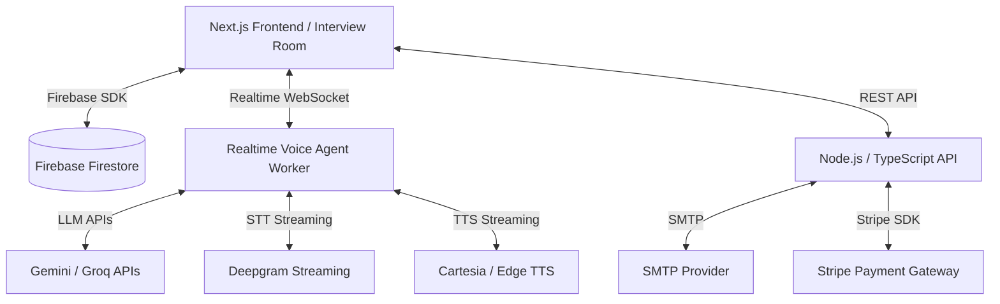

# Software Requirements Specification (SRS)

# HireAI - AI Powered Recruitment & Interview Intelligence Platform

---

# 1. Introduction

## 1.1 Purpose

This document specifies the software requirements for the HireAI platform, an advanced AI-powered recruitment and candidate vetting system.

The platform is designed to automate candidate screening, resume analysis, AI-driven interviews, recruiter intelligence generation, and hiring evaluation workflows.

This document defines the:
- Functional requirements
- Non-functional requirements
- Security requirements
- AI interview orchestration requirements
- System architecture
- External integrations
- Candidate evaluation workflows

---

## 1.2 Scope

HireAI is a multi-tenant SaaS recruitment platform designed for HR agencies, recruiters, staffing firms, and hiring teams.

The platform provides:

- Resume Parsing & Candidate Screening
- AI Resume Scoring
- Job Description Matching
- AI-Powered Realtime Interviewing
- Adaptive Follow-Up Questioning
- Candidate Evaluation Intelligence
- Recruiter Review Reports
- Multi-Organization Tenant Management
- Interview Transcript Generation
- Lightweight Interview Integrity Monitoring

The platform is optimized for:
- Fast recruiter workflows
- Automated candidate filtering
- Human-like AI interviews
- Low-latency conversational AI
- Recruiter-focused hiring intelligence

---

## 1.3 Definitions, Acronyms, and Abbreviations

| Term | Meaning |
|------|---------|
| SRS | Software Requirements Specification |
| STT | Speech-to-Text |
| TTS | Text-to-Speech |
| LLM | Large Language Model |
| WebRTC | Web Real-Time Communication |
| WebSocket | Persistent realtime communication protocol |
| XTTS | Cross-Language Text-to-Speech |
| PII | Personally Identifiable Information |
| SMTP | Simple Mail Transfer Protocol |

---

# 2. Overall Description

## 2.1 Product Perspective

HireAI operates as a cloud-native AI recruitment platform.

The architecture combines:
- Firebase Authentication
- Firestore Database
- Realtime conversational AI
- AI inference APIs
- Realtime audio orchestration
- AI-generated recruiter intelligence

### Architecture Overview

---

## 2.2 Product Functions

The HireAI platform provides:

### Resume Processing
- Resume uploads
- PDF parsing
- Docx parsing
- Skill extraction
- Resume scoring

### Job Management
- Job creation
- Evaluation criteria setup
- Candidate shortlisting
- Skill requirement configuration

### AI Interviewing
- Realtime voice interviews
- Adaptive questioning
- Follow-up generation
- Transcript generation
- Communication analysis

### Recruiter Intelligence
- Candidate scorecards
- Technical evaluation
- Hiring recommendations
- Evidence-based citations
- Red flag analysis

### Organization Management
- Tenant branding
- SMTP configuration
- Recruiter invitations
- Role-based access control

---

## 2.3 User Classes and Characteristics

### System Administrator
- Global platform management
- Organization approval
- Billing oversight
- Security management

### Organization Owner
- Recruiter management
- Billing configuration
- Branding customization
- SMTP configuration

### Recruiter / Hiring Manager
- Job creation
- Resume screening
- Interview scheduling
- Candidate review
- Hiring decisions

### Candidate
- Resume upload
- AI interview participation
- Profile verification

---

## 2.4 Operating Environment

### Frontend
- Chrome
- Edge
- Safari
- Firefox

### Backend
- Node.js v18+
- TypeScript runtime
- Firebase services

### Database
- Firebase Firestore

### Realtime Services
- WebSockets
- WebRTC
- Realtime AI APIs

---

# 3. System Features & Functional Requirements

# 3.1 Organization & Tenant Management

## 3.1.1 Description

Allows organizations to configure workspace identity and operational settings.

## 3.1.2 Functional Requirements

- Custom branding
- Logo upload
- Primary color themes
- SMTP configuration
- Recruiter invitations
- Organization-level AI settings

---

# 3.2 Job & Evaluation Criteria Definition

## 3.2.1 Description

Allows recruiters to create job requirements and candidate evaluation rules.

## 3.2.2 Functional Requirements

### Requirement Schema
- must_have_skills
- nice_to_have_skills
- required_education
- minimum_experience
- role_seniority

### Evaluation Weights
The platform shall support weighted evaluation scoring across:
- Skills Match
- Experience Fit
- Education
- Technical Depth
- Communication
- Cultural Fit

### Pass Thresholds
Recruiters may configure:
- Pass scores
- Rejection thresholds
- Auto-shortlist conditions

---

# 3.3 Candidate Upload & Resume Parsing

## 3.3.1 Description

Processes uploaded resumes into structured candidate intelligence.

## 3.3.2 Functional Requirements

### PDF Parsing
- Uses pdfjs-dist
- Layout-independent extraction

### DOCX Parsing
- Uses mammoth
- Structured content extraction

### Metadata Hashing
- Duplicate detection
- Resume fingerprinting

### Resume Intelligence
The system shall extract:
- Skills
- Experience
- Education
- Projects
- Certifications
- Technologies

---

# 3.4 AI Resume Screening & Scoring

## 3.4.1 Description

Automatically evaluates candidate resumes against job requirements.

## 3.4.2 Functional Requirements

### AI Scoring
The platform shall generate:
- Resume match score
- Skills score
- Experience score
- Seniority estimate
- Technical depth estimate

### AI Analysis
The platform shall generate:
- Resume summary
- Candidate strengths
- Candidate weaknesses
- Missing skills
- Risk indicators

### Candidate Classification
Candidates may be categorized as:
- Strong Fit
- Moderate Fit
- Weak Fit
- Rejected

---

# 3.5 AI Interview Room (Realtime Conversational Interview System)

## 3.5.1 Description

The HireAI Interview Room is a browser-based realtime conversational AI interviewing environment designed to simulate a professional recruiter-led screening interview.

The system conducts adaptive voice interviews using realtime speech transcription, contextual response generation, and dynamic follow-up questioning.

The AI interviewer operates entirely within the HireAI platform and does not depend on external conferencing platforms such as Google Meet or Zoom.

The interview system is optimized for:
- Low-latency communication
- Human-like conversational flow
- Adaptive questioning
- Resume-aware follow-ups
- Recruiter-focused evaluation outputs

---

## 3.5.2 Functional Requirements

### Realtime Audio Session

- Candidate microphone audio shall stream continuously through secure WebSocket/WebRTC communication.
- AI-generated responses shall be streamed back to the candidate with minimal latency.
- The interview room shall support realtime audio session persistence and recovery for temporary network interruptions.

---

### Streaming Speech-To-Text (STT)

- The platform shall transcribe candidate speech in realtime using streaming speech recognition providers.
- Partial transcript updates shall appear live within the candidate and recruiter interfaces.
- The system shall support fallback transcription providers for resiliency and fault tolerance.

---

### Streaming Text-To-Speech (TTS)

- AI-generated responses shall use low-latency neural voice synthesis.
- Recruiters may configure speaking pace settings globally at the organization level.
- The AI interviewer shall support natural pauses, pacing adjustments, and interruption-safe response playback.

---

### Conversational Memory

- The AI interviewer shall maintain interview context throughout the session.
- Previous candidate responses, detected skills, and resume claims shall dynamically influence future interview questions.
- The interview engine shall retain conversational state including:
  - Previously asked questions
  - Candidate answers
  - Evaluated skills
  - Detected red flags
  - Remaining interview duration

---

### Dynamic Interviewing Engine

The AI interviewer shall dynamically adapt questions based on:
- Job description requirements
- Resume content
- Candidate responses
- Detected technical depth
- Communication quality
- Candidate confidence indicators

The interview engine shall support:
- Technical interviews
- Behavioral interviews
- Screening interviews
- Experience validation interviews

---

### Adaptive Follow-Up Questioning

- The AI interviewer shall generate contextual follow-up questions automatically.
- Follow-up questions shall validate:
  - Resume authenticity
  - Claimed technical expertise
  - Project ownership
  - Problem-solving capability
  - Communication depth

---

### Realtime Conversation Orchestration

The platform shall include a realtime orchestration layer responsible for maintaining natural conversational flow.

The orchestration engine shall:
- Detect candidate interruptions
- Prevent AI over-speaking
- Detect silence thresholds
- Manage conversational pacing
- Handle incomplete answers
- Support natural turn-taking behavior
- Delay or accelerate responses dynamically depending on conversation flow

---

### Interview Intelligence & Evaluation

During the interview session, the system shall evaluate:
- Technical depth
- Communication quality
- Confidence indicators
- Relevance of responses
- Detail richness
- Problem-solving capability
- Consistency with resume claims

The system shall dynamically update candidate evaluation scores during the interview.

---

### Recruiter Review Output

At interview completion, the platform shall generate:
- Full interview transcript
- AI-generated interview summary
- Skill scorecards
- Communication analysis
- Technical evaluation
- Red flag indicators
- Confidence scoring
- Hiring recommendation
- Supporting evidence citations extracted from transcript and resume content

---

### Lightweight Proctoring Events

The platform may optionally capture lightweight integrity signals including:
- Tab-switch events
- Window focus loss
- Microphone disconnect events

These events shall be logged for recruiter review purposes only.

---

### Scalability & Infrastructure Constraints

Realtime interview orchestration services may operate independently from frontend serverless infrastructure.

The conversational AI worker shall support:
- Persistent websocket connections
- Streaming audio processing
- Session-level conversational memory
- Realtime AI inference orchestration

The platform shall prioritize low-latency API-driven voice processing over local GPU-dependent voice synthesis models during MVP deployment.

---

# 3.6 Evaluation Scorecards & Recruiter Intelligence

## 3.6.1 Description

Compiles candidate interview and resume performance into structured recruiter intelligence.

## 3.6.2 Functional Requirements

### Unified Candidate Score
The platform shall generate:
- Aggregate score (0-100)
- Technical score
- Communication score
- Confidence score
- Resume match score

### Evidence-Based Citations
All evaluations shall include evidence extracted from:
- Resume content
- Interview transcript
- Candidate responses

### Red Flag Detection
The platform shall identify:
- Resume inconsistencies
- Generic responses
- Avoidance behavior
- Weak technical explanations

### Recruiter Summary
The platform shall generate:
- Candidate strengths
- Candidate weaknesses
- Hiring recommendation
- Suggested next steps

---

# 4. External Interface Requirements

## 4.1 User Interfaces

### Recruiter Dashboard
- Candidate pipeline
- Resume analytics
- Interview reports
- Job management

### Candidate Interview Room
- Dark mode interface
- Realtime transcript
- Speaking indicators
- Microphone testing
- AI status indicators

---

## 4.2 Database Schema

### /organizations/{orgId}
- Branding
- SMTP settings
- Organization configuration

### /jobs/{jobId}
- Job requirements
- Evaluation criteria
- Interview templates

### /candidates/{candidateId}
- Resume data
- Scores
- Interview transcripts
- Reports

---

# 5. Security & Verification Requirements

## 5.1 Authentication & Authorization

- Firebase Authentication
- Email verification enforcement
- Role-based access control
- Organization-bound data access

---

## 5.2 Validation & Integrity Rules

### ID Validation
- Prevent malformed identifiers
- Prevent path traversal

### Enum Restrictions
- Strict status validation

### Field Constraints
- Firestore document limits
- Upload restrictions
- Input sanitization

---

# 6. Recommended MVP Technology Stack

| Layer | Technology |
|---|---|
| Frontend | Next.js |
| Hosting | Vercel |
| Database/Auth | Firebase |
| Backend API | Node.js + TypeScript |
| Voice Worker | Pipecat AI |
| LLM | Gemini / Groq |
| Speech-to-Text | Deepgram |
| Text-to-Speech | Cartesia / Edge TTS |
| Payments | Stripe |
| Email | Nodemailer |
| Realtime Communication | WebSockets / WebRTC |

---

# 7. MVP Constraints

- External conferencing automation shall not be mandatory.
- Browser automation for Google Meet is outside MVP scope.
- Local GPU voice cloning models are optional.
- API-driven realtime voice architecture is preferred for MVP stability.

