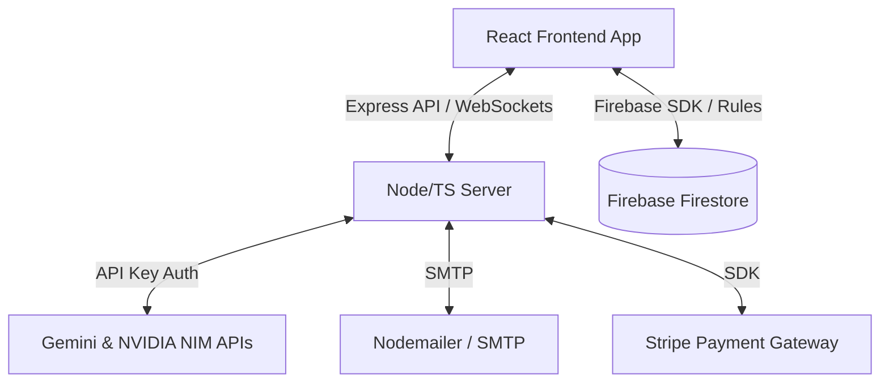

# Software Requirements Specification (SRS)

## 1. Introduction

### 1.1 Purpose
This document specifies the software requirements for the **HireAI** platform, an advanced AI-powered recruitment and candidate vetting system. It details the functional, external interface, security, and non-functional requirements of the system.

### 1.2 Scope
HireAI is a multi-tenant Web application designed to automate, secure, and deepen candidate evaluation. 
Key capabilities include:
*   **Resume Parsing & Screening**: Extracts structured skills, experience, and education from candidate resumes.
*   **AI Deep Research Engine**: Automatically queries public profiles and web resources to verify credentials, estimate seniority, evaluate reputation, and identify risk signals.
*   **Interactive Voice Interviewing**: Hosts live, low-latency audio interviews where an AI interviewer dynamically asks custom-tailored questions. Includes Microsoft Edge TTS/Coqui XTTS-v2 voice synthesis, Web Speech API/Whisper transcription, and real-time pace/speech speed adjustments.
*   **Proctoring & Anti-Cheating**: Records and flags tab-switching, camera-leave events, and voice anomalies during live interviews.
*   **Structured Scorecards**: Generates a unified score (0-100) along with detailed performance dimensions, signal density ratings, red flags, and exact grounding citations mapping claims directly back to the candidate's resume or interview transcript.

### 1.3 Definitions, Acronyms, and Abbreviations
*   **SRS**: Software Requirements Specification
*   **TTS**: Text-to-Speech
*   **STT**: Speech-to-Text
*   **XTTS**: Cross-Language Text-to-Speech (using voice cloning)
*   **NIM**: NVIDIA Inference Microservice
*   **GEMINI**: Google's Generative AI LLM family
*   **PII**: Personally Identifiable Information
*   **SMTP**: Simple Mail Transfer Protocol

---

## 2. Overall Description

### 2.1 Product Perspective
HireAI operates as a cloud-native SaaS application integrated with Firebase (Authentication, Firestore, Security Rules), Google Gemini / NVIDIA NIM APIs for LLM processing, Microsoft Edge TTS or local XTTS-v2 for speech synthesis, Stripe for billing/subscriptions, and Nodemailer for candidate outreach.

### 2.2 Product Functions
*   **Tenant & Organization Management**: Custom branding, custom SMTP settings, work hour parameters, and global AI voice pace controls.
*   **Job Posting & Criteria Setup**: Creating open roles with explicit thresholds, must-have/nice-to-have skills, and customizable criteria weighting.
*   **Multi-Modal Resume Upload**: Bulk parsing of PDF/Docx files using PDF.js and Mammoth.
*   **Deep Vetting (Background Research)**: Autonomous verification of online presence to construct career narratives, evaluate industry visibility, and score engineering depth.
*   **AI Interview Room**: Real-time voice interaction with active pacing controls, automated questions, transcript generation, and proctoring surveillance.
*   **Candidate Scorecards**: Detailed audit trails showing grounding citations (linking scores to raw resume quotes) and penalty-weighted red flags.

### 2.3 User Classes and Characteristics
1.  **System Administrator**: Direct database, organization status control, global system limits, and server configurations.
2.  **Organization Owner**: Configures billing (Stripe), manages tenant-wide configurations (e.g., SMTP settings, company logos, primary color themes), and invites recruiters.
3.  **Recruiter / Hiring Manager**: Creates jobs, uploads resumes, runs Deep Research, schedules interviews, and reviews candidates' scorecards.
4.  **Candidate**: Fills out profile verification, uploads resumes, accesses the voice interview room, and speaks with the AI interviewer.

### 2.4 Operating Environment
*   **Frontend**: Modern web browsers (Chrome, Edge, Safari, Firefox) with WebRTC and microphone permissions enabled.
*   **Backend Server**: Node.js v18+ environment running on Windows, Linux, or Vercel Serverless.
*   **Database**: Cloud Firestore.

---

## 3. System Features & Functional Requirements

### 3.1 Organization & Tenant Management
#### 3.1.1 Description
Allows organization owners to configure their workspace identity, notification gateways, and automated behaviors.
#### 3.1.2 Functional Requirements
*   **Custom Branding**: Upload of corporate logos and configuration of primary hex color codes.
*   **SMTP Gateway Setup**: Input of SMTP server host, port, secure SSL/TLS settings, and credential parameters to dispatch emails from the tenant's own domain.
*   **Bot Speed Settings**: A numeric multiplier setting (`botSpeakingPace` e.g., 0.8x to 1.5x) to customize how quickly the AI voice responds to candidates.

### 3.2 Job & Evaluation Criteria Definition
#### 3.2.1 Description
Enables recruiters to publish job specifications and define evaluation criteria weights.
#### 3.2.2 Functional Requirements
*   **Requirement Schema**: Storing `must_have_skills`, `nice_to_have_skills`, `min_experience_years`, `required_education`, and `role_seniority`.
*   **Evaluation Weights**: Set percentage importance weights across five dimensions:
    1.  *Skills Match*
    2.  *Experience Fit*
    3.  *Education*
    4.  *Achievements*
    5.  *Cultural & Role Fit*
*   **Pass/Fail Thresholds**: Configurable scoring boundaries for immediate filtering (e.g., `Passed` score >= 70, `Low Fit` score < 40).

### 3.3 Candidate Upload & PDF/Docx Parsing
#### 3.3.1 Description
Processes raw resume files into structured text content.
#### 3.3.2 Functional Requirements
*   **PDF Parsing**: Uses `pdfjs-dist` to extract layout-independent text structures from uploaded PDF resumes.
*   **Docx Parsing**: Uses `mammoth` to extract text from MS Word documents.
*   **Resume Metadata Hashing**: Computes cryptographic hashes of documents to prevent double-uploading or duplicate evaluation runs.

### 3.4 AI Deep Research Engine
#### 3.4.1 Description
Leverages web search API or deep agents to retrieve verification metrics about candidates.
#### 3.4.2 Functional Requirements
*   **Verification Status**: Computes confidence thresholds (`VERIFIED`, `HIGH_CONFIDENCE`, `MEDIUM_CONFIDENCE`, `LOW_CONFIDENCE`, `NOT_FOUND`).
*   **Deep Scores**: Computes scores (0-100) for:
    *   *Engineering/Technical Depth*
    *   *Leadership Potential*
    *   *Communication Quality*
    *   *Reputation & Industry Visibility*
    *   *Stability & Growth Trajectory*
*   **Career Narrative**: Generates a high-quality written summary explaining career progress, jumps, and strengths.

### 3.5 AI Interview Room (Live Audio)
#### 3.5.1 Description
A live, audio-first interview workspace incorporating interactive AI, speech recognition, and synthesis.
#### 3.5.2 Functional Requirements
*   **Audio Synthesis (TTS)**: Uses `msedge-tts` or local `XTTS-v2` cloning to generate responses.
*   **Transcription (STT)**: Employs standard browser-based speech recognition API with fallbacks to OpenAI Whisper.
*   **Conversational Flow**: Dynamically adjusts prompts depending on candidate answers, tracking the interview history and the time remaining.
*   **Proctoring Tracker**: Captures client-side events:
    *   *Tab Switch*: Triggered when the candidate leaves the window.
    *   *Face Leave*: Uses camera sensors to track if candidate moves away.
    *   *Voice Anomaly*: Flags background voices or abnormal silences.

### 3.6 Evaluation Scorecard & Grounding Citations
#### 3.6.1 Description
Compiles candidate performance data into a structured review scorecard.
#### 3.6.2 Functional Requirements
*   **Grounding Citations**: Every scorecard dimension must contain citations featuring the exact source quote from the resume or transcript to prevent AI hallucination.
*   **Red Flag Detector**: Evaluates candidate statements against pre-configured filters and applies custom penalty points (Low/Medium/High severity) to the final scorecard.
*   **Signal Density**: Generates a meta-evaluation of the interview quality, verifying whether the candidate actually spoke in detail or avoided answering the questions.

---

## 4. External Interface Requirements

### 4.1 User Interfaces
*   **Recruiter Portal**: Features a dashboard layout with visual analytics (Recharts), candidate pipeline boards, job creation modals, and individual candidate inspection views.
*   **Candidate Room**: A minimalist, high-immersion dark-mode workspace. Contains microphone test buttons, status animations showing active listening/speaking, and clear instructional alerts.

### 4.2 Database & Storage Schema (Firestore)
*   `/organizations/{orgId}`: Basic settings, custom branding, and custom SMTP keys.
*   `/jobs/{jobId}`: Title, description, status, and custom evaluation criteria schema.
*   `/candidates/{candidateId}`: Personal details, resume metadata, scoring dimensions, grounding citations, and proctoring log events.

---

## 5. Security & Verification Requirements

### 5.1 Identity & Authorization Invariants
*   **Email Verification**: The Firebase Security rules enforce `request.auth.token.email_verified == true` for any write commands.
*   **Ownership Bound**: A user can only read or write jobs, candidates, or analytics where `createdBy` matches `request.auth.uid` or matches their validated `organizationId`.

### 5.2 Anti-Poisoning & Validation Guards
*   **ID Validation**: All resource identifiers must comply with standard alphanumerical string formatting constraints to avoid injection or path traversal attempts.
*   **Enum Restraints**: State changes must match strict predefined strings (e.g. candidate status: `processed`, `shortlisted`, `rejected`).
*   **Field Constraints**: Limits document size and field count to prevent schema bloating attacks.
